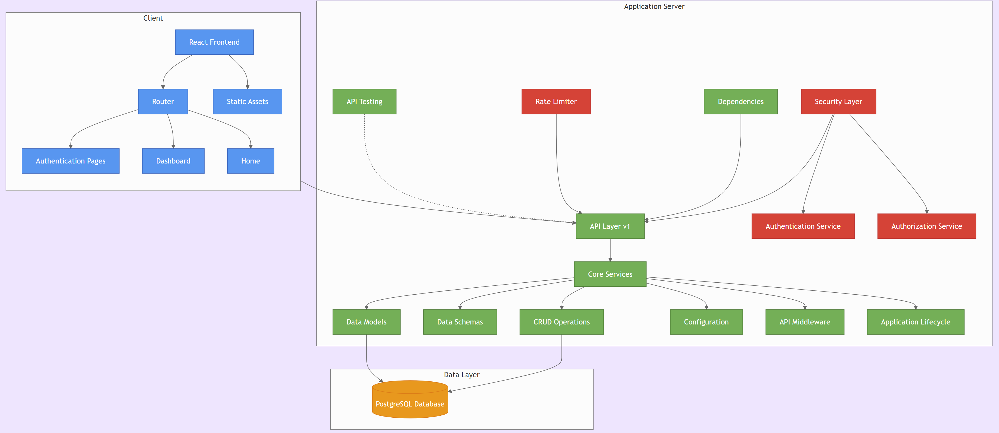

<!-- LINK GROUP -->
[deploy-on-zeabur-button-image]: https://zeabur.com/button.svg
[deploy-on-zeabur-link]: https://zeabur.com/templates/A2TNYB

# FastAPI FullStack Example

This example starts up a [FastAPI](https://fastapi.tiangolo.com/) server with [PostgreSQL](https://www.postgresql.org/) as backend.

[![][deploy-on-zeabur-button-image]][deploy-on-zeabur-link]

Overall Structure (Built with [GitDiagram](https://gitdiagram.com/glowiep/Fullstack-FastAPI))

## ✨ Features

- FastAPI
- [uvicorn](https://www.uvicorn.org/)
- Python 3

## 💁‍♀️ How to use

- Clone locally and install packages with pip using `pip install -r requirements.txt`
- Update the .env file to include `COHERE_API_KEY = "<Cohere API key>"`. You can get a key from the [Cohere dashboard](https://dashboard.cohere.com/api-keys).
- Run locally using `python -m backend.app.main` or `python3 -m backend.fastapi.main`

## 📝 Notes

- To learn about how to use FastAPI with most of its features, you can visit the [FastAPI Documentation](https://fastapi.tiangolo.com/tutorial/)
- To learn about Uvicorn and how to configure it, read their [Documentation](https://www.uvicorn.org/)
